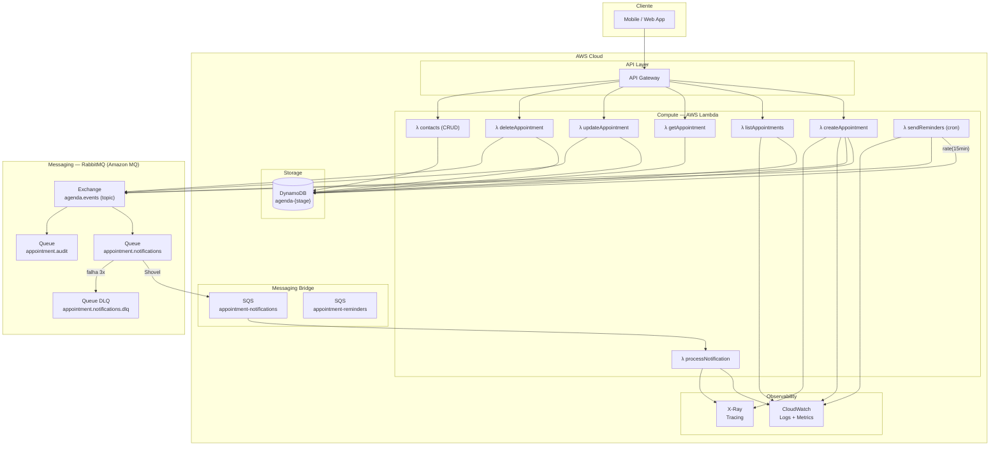
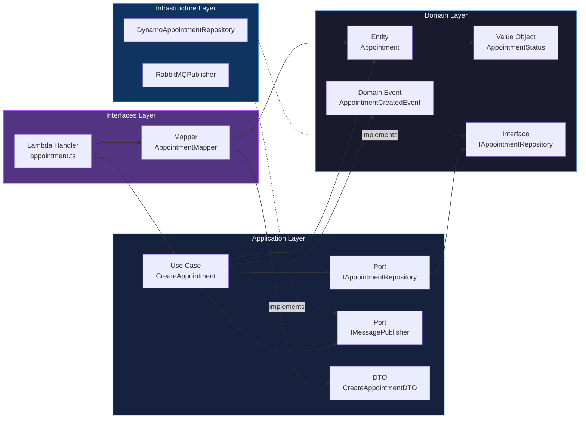
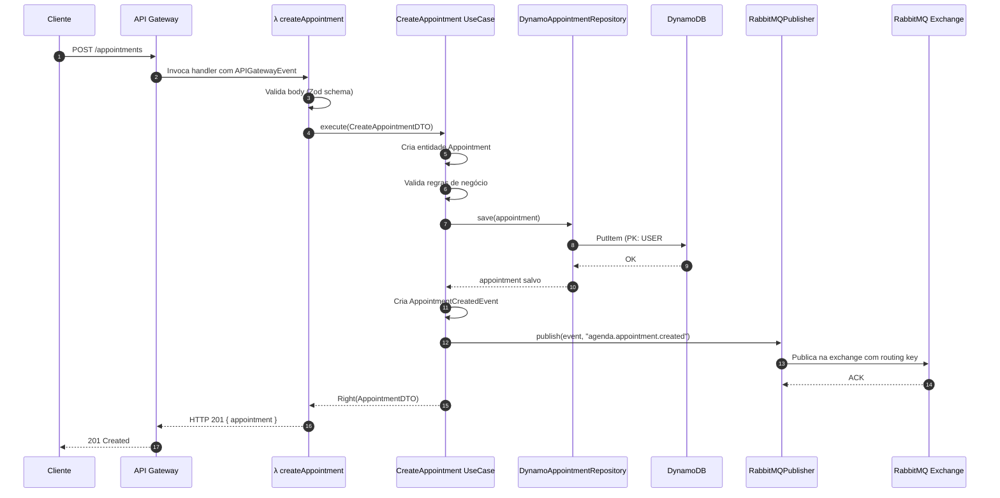
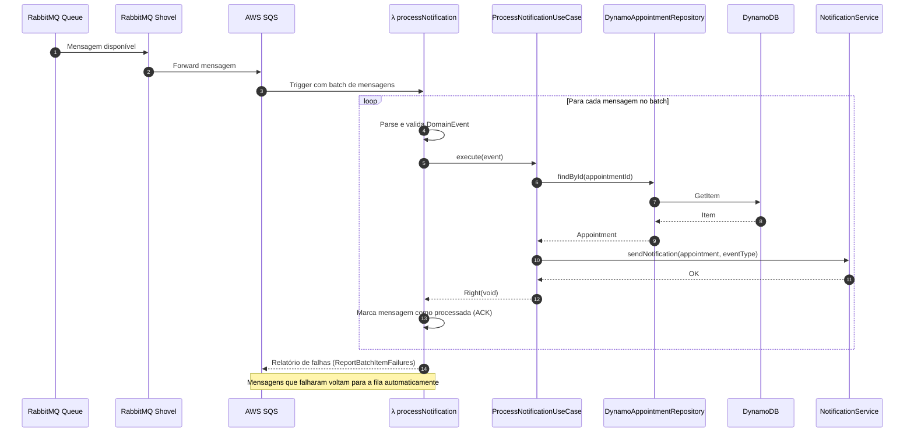
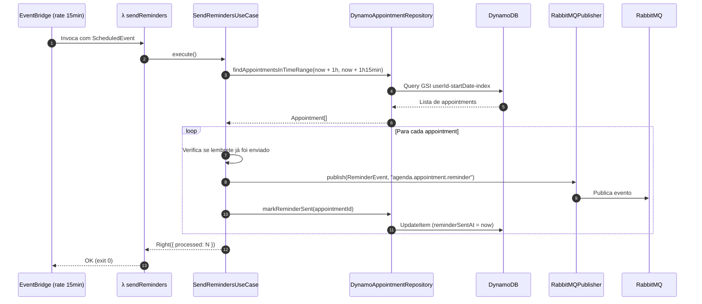
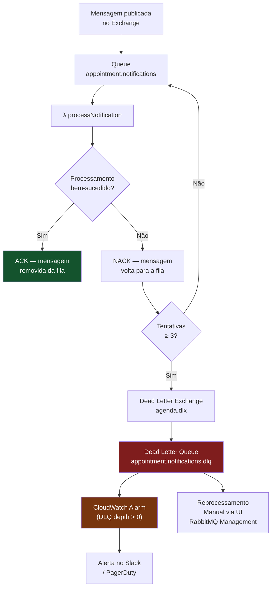
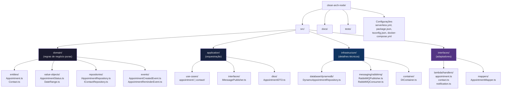

# Diagramas de Arquitetura — Agenda API

Este documento contém os diagramas de fluxo e arquitetura do sistema em formato Mermaid.

---

## 1. Visão Geral da Arquitetura do Sistema



---

## 2. Clean Architecture — Dependências entre Camadas



---

## 3. Fluxo — Criar Compromisso (Happy Path)



---

## 4. Fluxo — Processar Notificação (Consumer Lambda)



---

## 5. Fluxo — Lembrete Automático (Cron)



---

## 6. Fluxo — Dead Letter Queue (Tratamento de Falhas)



---

## 7. Modelagem de Dados — Single-Table Design DynamoDB

```mermaid
erDiagram
    DYNAMO_TABLE {
        string PK "Partition Key"
        string SK "Sort Key"
        string GSI1PK "GSI1 Partition Key (userId)"
        string GSI1SK "GSI1 Sort Key (startDate)"
        string entityType "APPOINTMENT | CONTACT"
        string id
        string userId
        string status
        string createdAt
        string updatedAt
    }

    APPOINTMENT_ITEM {
        string PK "USER#{userId}"
        string SK "APPOINTMENT#{id}"
        string GSI1PK "userId"
        string GSI1SK "startDate (ISO 8601)"
        string title
        string description
        string startDate
        string endDate
        string status "SCHEDULED|COMPLETED|CANCELLED"
        string contactId
        boolean reminderSent
        string reminderSentAt
    }

    CONTACT_ITEM {
        string PK "USER#{userId}"
        string SK "CONTACT#{id}"
        string name
        string email
        string phone
    }

    DYNAMO_TABLE ||--o{ APPOINTMENT_ITEM : "contém"
    DYNAMO_TABLE ||--o{ CONTACT_ITEM : "contém"
```

---

## 8. Estrutura de Pastas do Projeto


